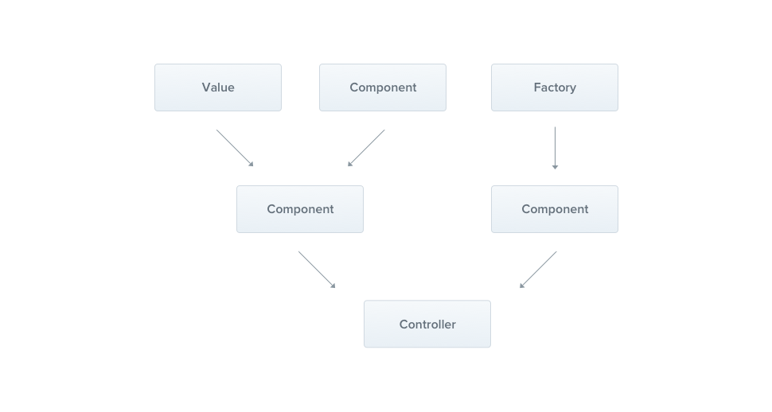

> [!IMPORTANT]
> Make sure you are using at least node version 20.

### Development

1. install the dependencies with
   `yarn`
2. run in dev mode
   `npm run start:dev`

### DATABASE_URL

`DATABASE_URL` is a mandatory setting
`DATABASE_URL=file:<path_to_db_file>` will create a local sqlite database as a file.
E.g. `DATABASE_URL="file:./dev.sqlite"`

Use the following structure for production
`DATABASE_URL=postgres://<username>:<password>@<host>:<port>/<database_name>`

## PRISMA

Ensure you have your `.env.development` and `.env.production` files set up.

Example .env.development:

```
DATABASE_URL="file:./dev.sqlite"
TELEGRAM_BOT_TOKEN="your_telegram_bot_token"
NODE_ENV=development
CURRENT_ENVIRONMENT=testnet
```

## Migrate Database

For development:
```yarn run migrate:dev```

For production:
```yarn run migrate:prod```

# Nest providers workflow:



# PR rules:

1. change in schema.prisma to ```provider = "postgresql"```
2. in pnl.service.integration.spec.ts change to  ```describe.skip('PnlService', () => { ```# Trading_Bot
# Solana_Trading_Bot
